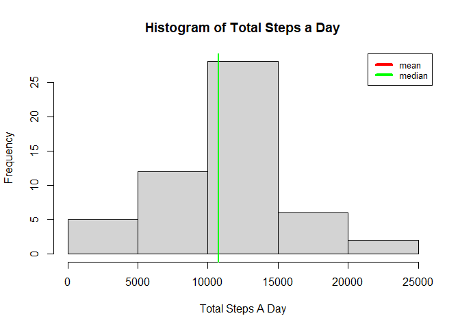
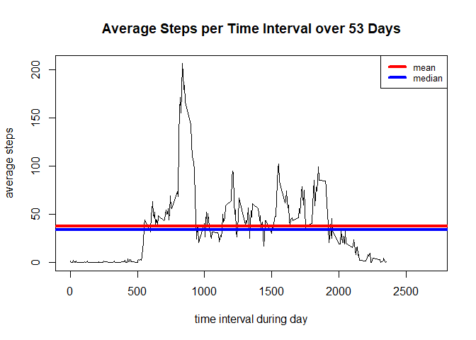
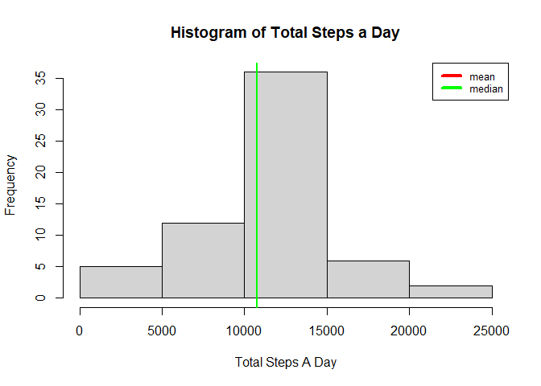
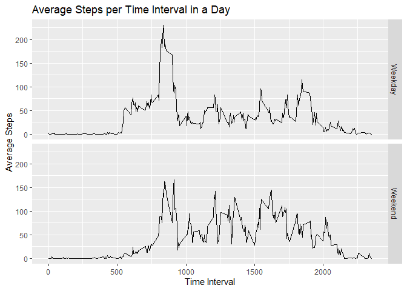

# Assignment
This assignment makes use of data from a personal activity monitoring
device. This device collects data at 5 minute intervals through out the
day. The data consists of two months of data from an anonymous
individual collected during the months of October and November, 2012
and include the number of steps taken in 5 minute intervals each day.

## Data

The data for this assignment can be downloaded from the course web
site:

* Dataset: [Activity monitoring data](https://d396qusza40orc.cloudfront.net/repdata%2Fdata%2Factivity.zip) [52K]
* The data set is in the file 'activity.csv'.

The variables included in this dataset are:

* **steps**: Number of steps taking in a 5-minute interval (missing
    values are coded as `NA`)

* **date**: The date on which the measurement was taken in YYYY-MM-DD
    format

* **interval**: Identifier for the 5-minute interval in which
    measurement was taken


The dataset is stored in a comma-separated-value (CSV) file and there
are a total of 17,568 observations in this
dataset.


## Loading and preprocessing the data

```r
library(tibble)
library(dplyr)
```

```
## 
## Attaching package: 'dplyr'
```

```
## The following objects are masked from 'package:stats':
## 
##     filter, lag
```

```
## The following objects are masked from 'package:base':
## 
##     intersect, setdiff, setequal, union
```

```r
acttvtee<-read.csv("./activity.csv")
tbb0 <- as_tibble(acttvtee)
str(tbb0)
```

```
## tibble [17,568 x 3] (S3: tbl_df/tbl/data.frame)
##  $ steps   : int [1:17568] NA NA NA NA NA NA NA NA NA NA ...
##  $ date    : chr [1:17568] "2012-10-01" "2012-10-01" "2012-10-01" "2012-10-01" ...
##  $ interval: int [1:17568] 0 5 10 15 20 25 30 35 40 45 ...
```

```r
tbb1 <- filter(tbb0, !is.na(steps))
```


## What is mean total number of steps taken per day?

For this part of the assignment, you can ignore the missing values in
the dataset.(We do this above in the *Loading and preprocessing the data* step. )

### **1. Make a histogram of the total number of steps taken each day**


```r
tbb2<-group_by(tbb1, date) %>% summarise(step_total=sum(steps))
```

```
## `summarise()` ungrouping output (override with `.groups` argument)
```

```r
str(tbb2)
```

```
## tibble [53 x 2] (S3: tbl_df/tbl/data.frame)
##  $ date      : chr [1:53] "2012-10-02" "2012-10-03" "2012-10-04" "2012-10-05" ...
##  $ step_total: int [1:53] 126 11352 12116 13294 15420 11015 12811 9900 10304 17382 ...
```

```r
hist(tbb2$step_total, main = "Histogram of Total Steps a Day", xlab="Total Steps A Day")
abline(v=mean(tbb2$step_total), lwd =2, col="red")
abline(v=median(tbb2$step_total), lwd = 2, col="green")
legend("topright", legend=c("mean", "median"), col=c("red","green"), lty=1:1, lwd=4:4, cex=0.8)
```

<!-- -->

### **2. Calculate and report the *mean* and *median* total number of steps taken per day**.

We note some summary data from the above figure.


```
##    Min. 1st Qu.  Median    Mean 3rd Qu.    Max. 
##      41    8841   10765   10766   13294   21194
```
## What is the average daily activity pattern?


### **1. Make a time series plot (i.e. `type = "l"`) of the 5-minute interval (x-axis) and the average number of steps taken, averaged across all days (y-axis)**


```r
tbb3<-group_by(tbb1, interval) %>% summarise(avg_steps=mean(steps))
```

```
## `summarise()` ungrouping output (override with `.groups` argument)
```

```r
str(tbb3)
```

```
## tibble [288 x 2] (S3: tbl_df/tbl/data.frame)
##  $ interval : int [1:288] 0 5 10 15 20 25 30 35 40 45 ...
##  $ avg_steps: num [1:288] 1.717 0.3396 0.1321 0.1509 0.0755 ...
```

```r
with(tbb3, plot(interval, avg_steps,type="l",xlim =c(0, 2700), xlab="time interval during day", ylab="average steps"))
title(main="Average Steps per Time Interval over 53 Days")
abline(h=mean(tbb3$avg_steps), lwd=4, col="red")
abline(h=median(tbb3$avg_steps), lwd=4, col="blue")
legend("topright", legend=c("mean", "median"), col=c("red","blue"), lty=1:1, lwd=4:4, cex=0.8)
```

<!-- -->


***We note some summary data from the above figure.***


```
##    Min. 1st Qu.  Median    Mean 3rd Qu.    Max. 
##   0.000   2.486  34.113  37.383  52.835 206.170
```
### **2. Which 5-minute interval, on average across all the days in the dataset, contains the maximum number of steps?**

 The five minute interval, on average across all days in the data set that 
 contains the the maximum number of steps, is 835, as noted below:
 

```r
print(filter(tbb3, avg_steps==max(tbb3$avg_steps)))
```

```
## # A tibble: 1 x 2
##   interval avg_steps
##      <int>     <dbl>
## 1      835      206.
```

## Imputing missing values

### **1. Calculate and report the total number of missing values in the dataset (i.e. the total number of rows with `NA`s**

***Total number of missing values in the activity.csv data set is 2304 as noted below.***


```r
rows<-length(acttvtee$steps)
rows_of_NA_steps<-sum(is.na(acttvtee$steps))
rows_not_NA<-sum(!is.na(acttvtee$steps))
answ<-ifelse(rows== (rows_of_NA_steps + rows_not_NA),rows_of_NA_steps,NA)
answ
```

```
## [1] 2304
```

***We also note is that the field 'steps' is the only one with missing (NA) values. Note the
work which follows. We see 'date' and 'interval' have no missing values***


```r
rows<-length(acttvtee$date)
rows
```

```
## [1] 17568
```

```r
rows_of_NA_steps<-sum(is.na(acttvtee$date))
rows_not_NA<-sum(!is.na(acttvtee$date))
answ<-ifelse(rows== (rows_of_NA_steps + rows_not_NA),rows_of_NA_steps,NA)
answ
```

```
## [1] 0
```

```r
rows<-length(acttvtee$interval)
rows
```

```
## [1] 17568
```

```r
rows_of_NA_steps<-sum(is.na(acttvtee$interval))
rows_not_NA<-sum(!is.na(acttvtee$date))
answ<-ifelse(rows== (rows_of_NA_steps + rows_not_NA),rows_of_NA_steps,NA)
answ
```

```
## [1] 0
```
### **2. Devise a strategy for filling in all of the missing values in the dataset. The strategy does not need to be sophisticated. For example, you could use the mean/median for that day, or the mean for that 5-minute interval, etc.**

We will replace the missing values (which we have shown to be only in the field 'steps') with the average value
of the steps for the given time interval that was determined above.

### **3. Create a new dataset that is equal to the original dataset but with the missing data filled in.**


```r
t<-left_join(tbb0,tbb3)
```

```
## Joining, by = "interval"
```

```r
for(i in 1:length(t$steps)){
  if(is.na(t$steps[i])) {
    t$s[i]<-t$avg_steps[i]
  }
  else {
    t$s[i]<-t$steps[i]
  }
}
```

```
## Warning: Unknown or uninitialised column: `s`.
```

```r
t<-mutate(t, steps = s)
tbb1_1<-select(t, -avg_steps, -s)
str(tbb1_1)
```

```
## tibble [17,568 x 3] (S3: tbl_df/tbl/data.frame)
##  $ steps   : num [1:17568] 1.717 0.3396 0.1321 0.1509 0.0755 ...
##  $ date    : chr [1:17568] "2012-10-01" "2012-10-01" "2012-10-01" "2012-10-01" ...
##  $ interval: int [1:17568] 0 5 10 15 20 25 30 35 40 45 ...
```

### **4. Make a histogram of the total number of steps taken each day and Calculate and report the *mean* and *median* total number of steps taken per day. Do these values differ from the estimates from the first part of the assignment? What is the impact of imputing missing data on the estimates of the total daily number of steps?**

***Now we will see how this impacts results found when we looked at the mean of total steps a day.***


```r
tbb2_1<-group_by(tbb1_1, date) %>% summarise(step_total=sum(steps))
```

```
## `summarise()` ungrouping output (override with `.groups` argument)
```

```r
str(tbb2_1)
```

```
## tibble [61 x 2] (S3: tbl_df/tbl/data.frame)
##  $ date      : chr [1:61] "2012-10-01" "2012-10-02" "2012-10-03" "2012-10-04" ...
##  $ step_total: num [1:61] 10766 126 11352 12116 13294 ...
```

```r
hist(tbb2_1$step_total, main = "Histogram of Total Steps a Day", xlab="Total Steps A Day")
abline(v=mean(tbb2_1$step_total), lwd =2, col="red")
abline(v=median(tbb2_1$step_total), lwd = 2, col="green")
legend("topright", legend=c("mean", "median"), col=c("red", "green"), lty=1:1, lwd=4:4, cex=0.8)
```

<!-- -->

***We note some summary data from the above figure.***


```
##    Min. 1st Qu.  Median    Mean 3rd Qu.    Max. 
##      41    9819   10766   10766   12811   21194
```
***And compare it with results from data where missing values were not replaced.***


```
##    Min. 1st Qu.  Median    Mean 3rd Qu.    Max. 
##      41    8841   10765   10766   13294   21194
```


## Are there differences in activity patterns between weekdays and weekends?

Use the dataset with the filled-in missing values for this part.

### **1. Create a new factor variable in the dataset with two levels -- "weekday" and "weekend" indicating whether a given date is a weekday or weekend day.**


```r
tbb1_2<-tbb1_1
tbb1_2$d<-as.POSIXct(strptime(tbb1_2$date, format="%Y-%m-%d"))
tbb1_2$w<-ifelse(weekdays(tbb1_2$d)=='Saturday' | weekdays(tbb1_2$d)=='Sunday', 'Weekend', 'Weekday')
str(tbb1_2)
```

```
## tibble [17,568 x 5] (S3: tbl_df/tbl/data.frame)
##  $ steps   : num [1:17568] 1.717 0.3396 0.1321 0.1509 0.0755 ...
##  $ date    : chr [1:17568] "2012-10-01" "2012-10-01" "2012-10-01" "2012-10-01" ...
##  $ interval: int [1:17568] 0 5 10 15 20 25 30 35 40 45 ...
##  $ d       : POSIXct[1:17568], format: "2012-10-01" "2012-10-01" ...
##  $ w       : chr [1:17568] "Weekday" "Weekday" "Weekday" "Weekday" ...
```
### **2. Make a panel plot containing a time series plot (i.e. `type = "l"`) of the 5-minute interval (x-axis) and the average number of steps taken, averaged across all weekday days or weekend days (y-axis).**


```r
library(ggplot2)
tbb3_f<-group_by(tbb1_2, w,interval) %>% summarise(avg_steps=mean(steps))
```

```
## `summarise()` regrouping output by 'w' (override with `.groups` argument)
```

```r
str(tbb3_f)
```

```
## tibble [576 x 3] (S3: grouped_df/tbl_df/tbl/data.frame)
##  $ w        : chr [1:576] "Weekday" "Weekday" "Weekday" "Weekday" ...
##  $ interval : int [1:576] 0 5 10 15 20 25 30 35 40 45 ...
##  $ avg_steps: num [1:576] 2.251 0.445 0.173 0.198 0.099 ...
##  - attr(*, "groups")= tibble [2 x 2] (S3: tbl_df/tbl/data.frame)
##   ..$ w    : chr [1:2] "Weekday" "Weekend"
##   ..$ .rows: list<int> [1:2] 
##   .. ..$ : int [1:288] 1 2 3 4 5 6 7 8 9 10 ...
##   .. ..$ : int [1:288] 289 290 291 292 293 294 295 296 297 298 ...
##   .. ..@ ptype: int(0) 
##   ..- attr(*, ".drop")= logi TRUE
```

```r
pl<-ggplot(tbb3_f,aes(interval, avg_steps))
pl<-pl+geom_line()
pl<-pl+facet_grid(tbb3_f$w~.)
pl<-pl+labs(title="Average Steps per Time Interval in a Day", x= "Time Interval", y="Average Steps")
print(pl)
```

<!-- -->

```r
tbb3_fwend<-filter(tbb3_f, w=="Weekend")
tbb3_fwday<-filter(tbb3_f, w=="Weekday")
```

***Let us look at the summary data for the weekend average steps per time interval.***

```
##    Min. 1st Qu.  Median    Mean 3rd Qu.    Max. 
##   0.000   1.241  32.340  42.366  74.654 166.639
```
***Now we will do the same for the weekday average.***

```
##    Min. 1st Qu.  Median    Mean 3rd Qu.    Max. 
##   0.000   2.247  25.803  35.611  50.854 230.378
```
